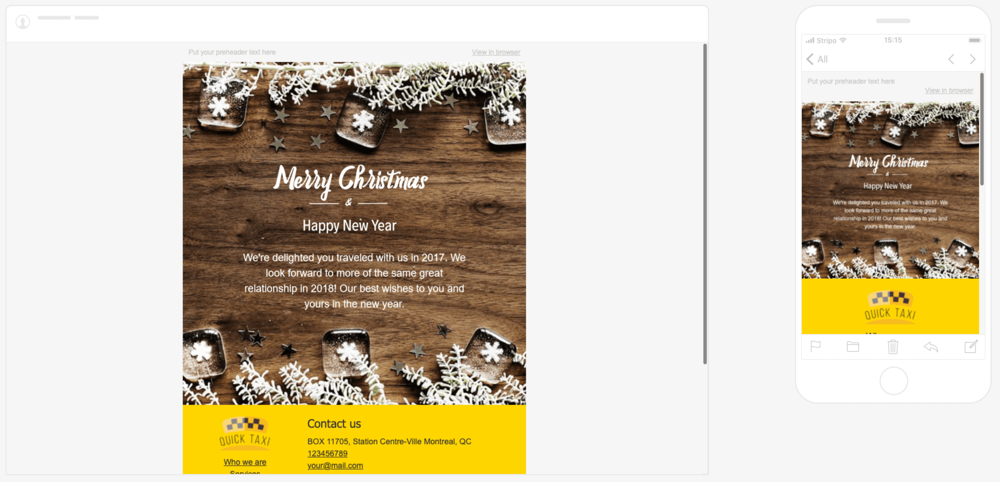
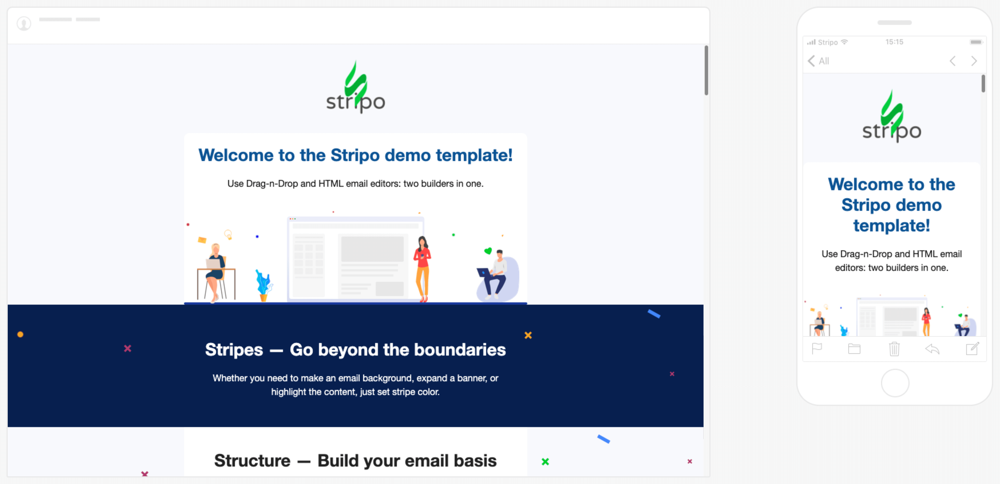
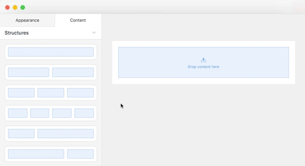
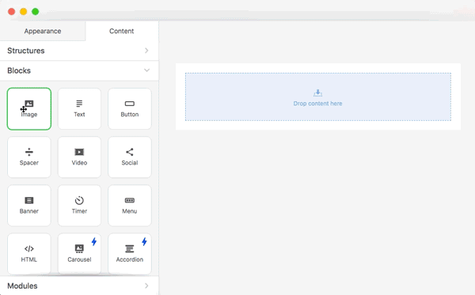

# Stripo——Email内卷神器

推荐一下最近新发现的**Email美化神器** [Stripo](https://stripo.email/)

先上点例子:

**模板**

**自定义**

可以看到Email已经完全达到了网页的设计效果，甚至还能自适应。这还不是最卷的，如果看看这编辑器，会发现更多更卷的功能。感兴趣的可以去自己尝试，这里主要分享下自己作为免费用户到目前的一些使用心得。

(👇🏻来源于官方)

**布局**

**组件**

## 优点

- **自适应** - 相较于其他一些Email模板工具，Stripo不仅是布局层面上提供了类栅格的自适应布局，在更下层如组件的编辑过程中也有很丰富的自适应编辑空间，甚至有像“仅桌面”“仅移动端”这样的配置。可以说这些功能让产出的Email在不同端上都能有不错的上限。
- **Padding/圆角** - 这是我最为欣赏的一点，不仅在这两点上支持自定义，甚至还允许在四个方向上分别配置，操作空间直接就上去了。
- **自定义HTML** - 虽然不是独此一家的功能，但作为前端看到这个功能确实能让在编辑Email的时候能更加大展拳脚。

## 缺点

- **层级嵌套** - Stripo在一定层面上也可以算低代码网页编辑了，所以自然也有层级嵌套的结构（毕竟最终是以HTML渲染的）。而就在这种环境下，类似于行容器和整行元素之间就会遇到一些小坑，比如加背景色的。只能说上限提高的代价就是额外增加了一部分配置复杂度。
- **预览渲染偏差** - 如果有使用自定义HTML的功能，需要注意预览时的渲染版本和真实发出的渲染版本会有差异（比如从CSS class能够发现区别），所以需要额外关注。**特别是尽量使用inline样式。**
- **每日5封测试** - 这个其实不算缺点，只能算免费账号的局限。就是每天只能发出五次测试邮件，但基本够用，除了遇到要调试什么bug可能还有点紧缺。
