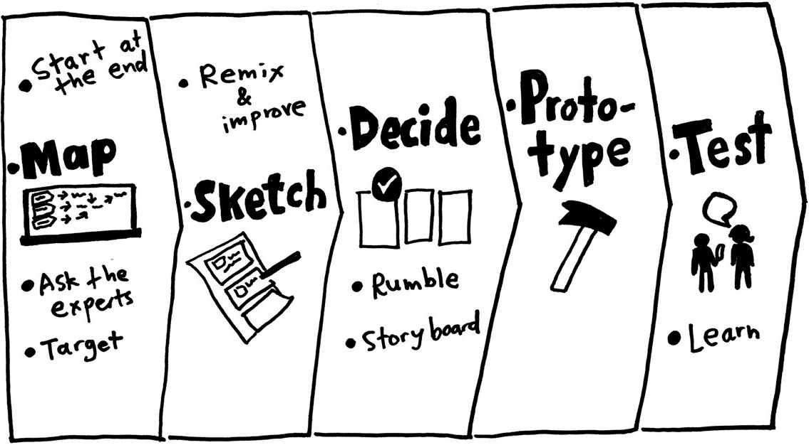

# 交互设计方法论

## 5W2H

由二战中美国陆军兵器修理部创造，被许多领域广泛使用。

- What
- Why
- Who
- When
- Where
- How to do
- How much

## [Design Sprint](https://www.gv.com/sprint/)

由Google Venture (谷歌风投团队) 创造，是一套为期5天快速完成产品设计的创新方法。五天被分别规划为如下图：

## [Double Diamond (双钻模型)](https://en.wikipedia.org/wiki/Double_Diamond_(design_process_model))

由英国设计协会提出，是由问题到解决方案的一种思维方式。两“钻”分别是在探究*做正确的事*和*用正确的方法*，而由进一步细分为四个阶段
- Discover
- Define
- Develop
- Deliver

