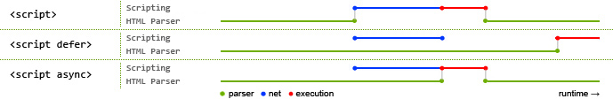

# [元数据标签](https://developer.mozilla.org/en-US/docs/Web/Guide/HTML/Content_categories#metadata_content)

相较于日常接触最多的那些语义化标签，元数据标签的知识往往容易被忽略，却同样十分重要。它们往往**用于表现整个文档的信息，包括其行为及与外部的关联**。目标多是向浏览器和搜索引擎等。它们通常会集中出现在HTML顶部的`<head>`中。

标签种类并不多，有以下几种:
- [`<title>`](#title)
- [`<base>`](#base)
- `<link>`
- [`<style>`](#style)
- [`<script>`](#script)
- [`<noscript>`](#noscript)
- [`<meta>`](#meta)

## [title](https://developer.mozilla.org/en-US/docs/Web/HTML/Element/title)
在浏览器顶部显示的标题。

:::caution 唯一性
`<head>`中必须且只能包含一个`<title>`。
:::

:::tip SPA的`<title>`定制
考虑到可用性等重要因素，对于“一页到底”的SPA来说每页有准确清晰的`<title>`是一个同样重要但很容易被忽略的点。
:::


## [base](https://developer.mozilla.org/en-US/docs/Web/HTML/Element/base)
改变全局相对URL的基础URL，属于历史遗留标签。此标签未声明时全局默认会使用`location.href`。属性与a标签类似。

```HTML
<base href="https://github.io/" target="_blank">
```

:::caution 至多一个
`<head>`中至多包含一个`<base>`。重复定义的base标签会被忽略。
:::

## [style](https://developer.mozilla.org/en-US/docs/Web/HTML/Element/style)

在`<head>`内显式地定义样式，而非像`link`引入外部样式表。可以通过`media`属性来区分适用的场景，和在CSS中设置media query是一样的写法。

```HTML
<!doctype html>
<html>
<head>
  <style media="all and (max-width: 480px)">
    p {
      font-size: 0.75rem;
    }
  </style>
</head>
<body>
  <p>字号在移动端会更小.</p>
</body>
</html>
```

## [script](https://developer.mozilla.org/en-US/docs/Web/HTML/Element/script)

用于给文档插入可运行代码或者嵌入数据。大部分情况都是JavaScript。

```HTML
<!-- 插入外部脚本 -->
<script src="app.js"></script>
<!-- 嵌入代码 -->
<script>console.log("Hi!")</script>
<!-- 嵌入JSON数据 -->
<script id="data" type="application/json">{ "key": "value"}</script>
```

:::tip 添加`async`或`defer`属性优化加载
不同情况下浏览器处理顺序为:



`<script>` - HTML解析暂停 -> 加载脚本 -> 执行脚本 -> HTML解析继续

`<script defer>` - HTML解析/同时加载脚本 -> （HTML解析完成）执行脚本

`<script async>` - HTML解析/同时加载脚本 -> （加载完成）HTML解析暂停 -> 执行脚本 -> HTML解析继续

所以能看到`defer`将脚本执行放到了最后，避免了执行过程中阻塞渲染；而`async`将原本加载+执行的阻塞事件缩短为了只有执行时间。可以根据场景选择优化方案。

:::

## [noscript](https://developer.mozilla.org/en-US/docs/Web/HTML/Element/noscript)

浏览器不支持脚本时，这段HTML会被显示出来。处理过比较细致的浏览器兼容性时应该都会用到。

## [meta](https://developer.mozilla.org/en-US/docs/Web/HTML/Element/meta)

可以当作除以上标签外的其他元数据类型，例如常用于搜索引擎的关键字（keywords）、作者（author）、描述（description）。通常有以下四类:

### 文档级信息 
带有`name`属性的meta标签。配合`content`表示值。`name`标准取值[MDN](https://developer.mozilla.org/en-US/docs/Web/HTML/Element/meta/name)有列出，其中就包含了上面的几个常见用例，同时也可以自定义。

```HTML
<meta name="description" content="这是一个例子">
<meta name="keywords" content="学习, 博客, 游戏">
```

:::note viewport
常用的`name=viewport`尽管没有在标准的"HTML Specification"中，但属于补充的"CSS Device Adaptation Specification"，所以也是标准之一。
:::

### 编译指示指令
带有`http-equiv`属性的meta标签。同样配合`content`表示值。`http-equiv`标准取值同样参考[MDN](https://developer.mozilla.org/en-US/docs/Web/HTML/Element/meta#attr-http-equiv)。例如在[Content Security Policy (CSP)](https://developer.mozilla.org/en-US/docs/Web/HTTP/CSP)中用到的`content-security-policy`

```HTML
<meta http-equiv="Content-Security-Policy"
      content="default-src 'self'; img-src https://*; child-src 'none';">
```

### 自定义元数据
带有`itenprop`属性的meta标签。同样配合`content`表示值。并且和常规不同，自定义情况下标签的内容类型除了元数据类型，也同样可为流数据，嵌在常规标签中。

```HTML
<span itemscope>
    <meta itemprop="name" content="some values">
</span>
```

### 字符编码声明
带有`charset`属性的meta标签。由于HTML5之后统一使用了`UTF-8`，所以其值只能为大小写不敏感的`UTF-8`。

:::tip 声明的意义
回顾历史，从最早的ASCII，到HTML4默认的ISO-8859-1以及额外的ANSI(Windows-1252)，再到现在普及的UTF-8，很难说以后的进一步发展。

而现在使用meta并标签不是唯一方式声明编码，还可以通过`name`取值`content-type`，或是服务器返回的同名Header来声明。当其他方式都没有声明时，用meta标签能有效规避一些情况下浏览器误用ASCII。

所以，综上所述个人理解更像是一种保护措施。
:::
