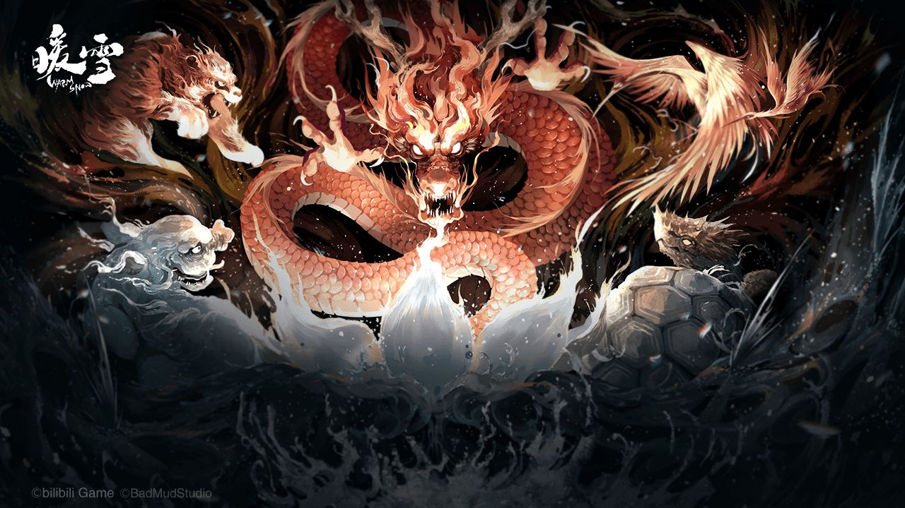

import IFramePlayer from "@site/src/components/CustomIFramePlayer/CustomIFramePlayer";

# 暖雪

[官网链接](https://game.bilibili.com/warmsnow/)

个人推荐: ⭐️⭐️⭐️⭐️ - **初雪虐我千百遍，一朝狂雪做神仙**

<!--truncate-->

## 国产高质量肉鸽

这些年雨后春笋般涌现的肉鸽让我辈狂喜，而暖雪算的上这当中国产顶尖了。从别具特色的暗黑神话武侠风，到花样百出的流派、武器、圣物、天赋搭配，再到优秀的配乐和特效，都能让喜欢肉鸽喜欢挑战的国人玩家沉迷上一阵。

<IFramePlayer source="//player.bilibili.com/player.html?aid=935742435&bvid=BV1mT4y117fz&cid=484430736&page=1"/>

## 眼花缭乱，大成太难

首先称赞一下拉满的随机元素设计。近战飞剑再加各色流派，排列组合十二种，很想让人挨个尝试。但越是眼花缭乱，平衡性和组合机制就越是重要。暖雪其实在这方面有做专门的考虑，例如在出货上区分了专属和通用，使得更容易刷出当前周目流派相关的物件。但由于武器、圣物、天赋之间又有联动，这使得一身”大成“的概率和买彩票无异，哪怕只是圣物间能够互相加持或是和武器联动都很看缘分，很容易出现一路散人打到后期甚至直到通关。

## 打通脉络式的挑战难度

有点标题党，但是真实感受。在开荒初雪的时候可能是因为一贯脸黑，一直一身散人装卡在第一章老猪。大概五六次之后，终于靠着流血中毒的毒瘤组合过了老猪，然后就过山车一样过关斩将到了最终龙帝前的虎大将军。尽管没有一次性滑到通关，但随着这单单一周目的天赋点累积和流派解锁，在稍微尝鲜了之后直接初雪通关，并靠老虎解锁的雷系直接飞雷神一路过了中雪大雪。个人感觉就像个在初雪举步维艰的凡人，瞬间打通任督二脉一路割草剑指狂雪。在高难度除了皮糙肉厚，没有太多感受到难度的增加和新的挑战，算是一点小小的遗憾。
